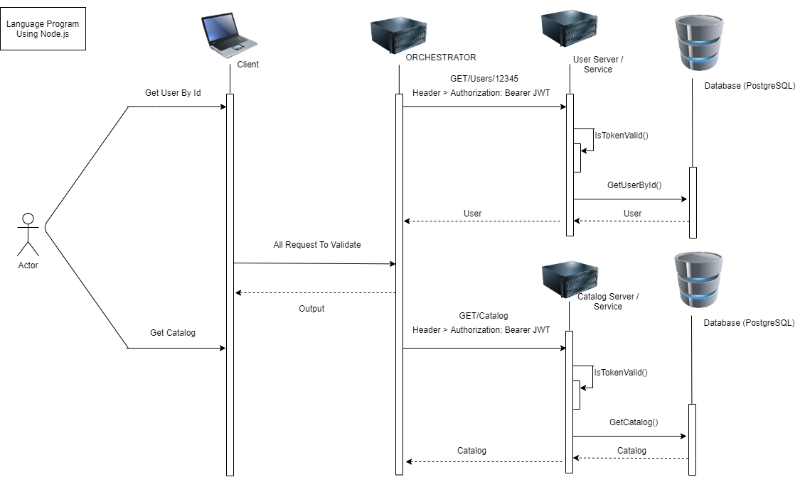

JAWABAN TEST

1. Buat marker beserta popup informasi marker ketika di klik dengan leaflet js (Frontend, Nodejs ejs)

2. Buat design arsitektur dan prosesnya berupa flow gambar dari konsep microservices di dalam docker container yang terdiri dari database dan aplikasi. Kasus: Kita akan deploy beberapa aplikasi terdiri dari frontend & backend (API), di dalam backend terdiri 2service yaitu service users & Katalog. Semua services di protect dengan token JWT untuk mengambil datanya. Notes: Jangan lupa memberikan keterangan dari masing2 service dan databasenya. Contoh DB = MongoDB/PostgreSql/MySql,Lang Program = nodejs/php/java/python

